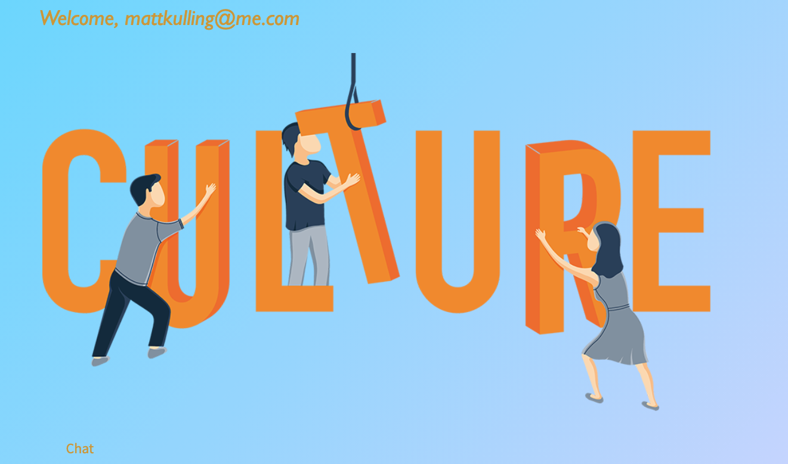

## Description

This project is a blog and CMS system about different cultural topics that allows authors to delete their own posts, and allows for non-author users to like posts and add comments that are then appended to a comment box. It also allows for users to chat with each other live  This project was created using Node, Express, Handlebars, Passport, and socket.io

# Table of Contents 

1. [Description](#Description)
 2. [Questions](#Questions?) 

 3. [Installation](#Installation) 

 4. [Usage](#Usage) 

 5. [Contributing](#Contributing) 

6. [License](#License) 

 7. [Tests](#Tests)

## Installation
Log on to the blog [here](https://gentle-cliffs-54160.herokuapp.com/)

## Screenshot

## Usage
Any user who wishes to contribute to the blog can do so by signing up for an account at the deployed [here](https://gentle-cliffs-54160.herokuapp.com/)

## Questions?

Contact us here:

[GitHub Profile](https://github.com/matthayden09/project_2)

[Email](mailto:mokulling@gmail.com)

 Reach out to me at either of the links above if you have any questions regarding the project or if you want to become a collaborator.

## License
CC
